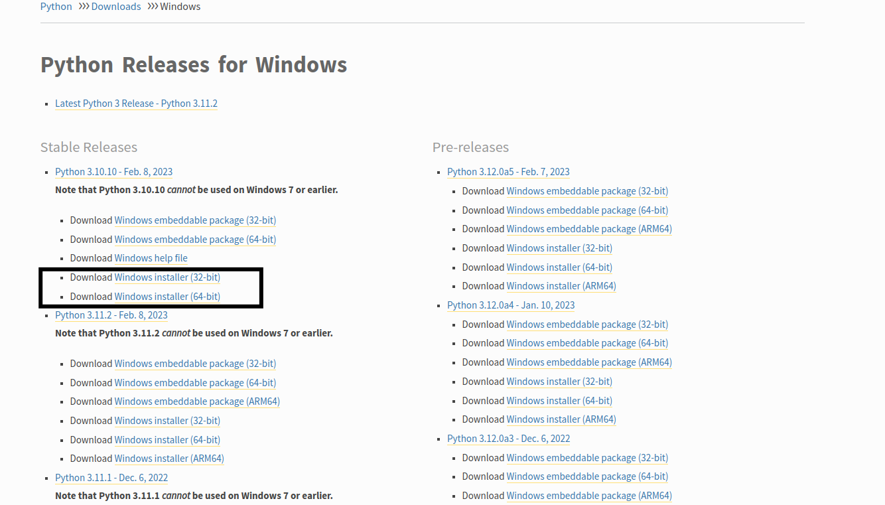
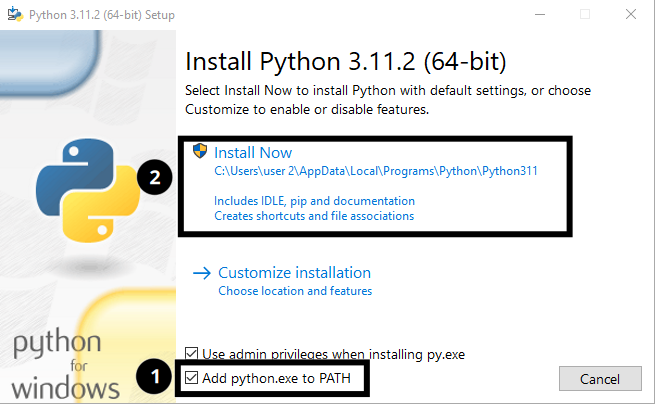
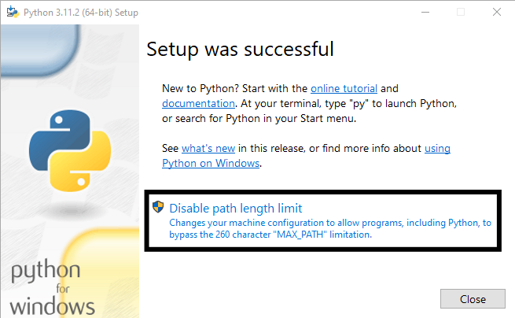
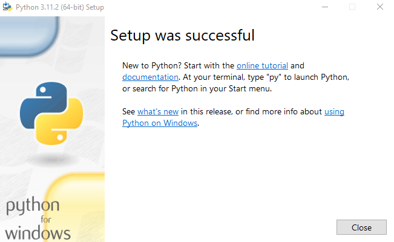

# :rocket: How To Set Up Python Environment on Windows 10 and 11
**Download Latest python installer from the link below:**
```cmd
https://www.python.org/downloads/windows/
```



> **Note**
> Depending on your system, download the appropriate version. If you are running a 64bit system then download the 64bit version.

**Double click on the downloaded python installer and check ```Add python.exe to PATH``` and click on ```Install Now```.** <br />


**Click on ```Disable path length limit``` then close.** <br />



> **Info**
> Disabling the path length limit means we can use more than 260 characters in a file path.

<br />




